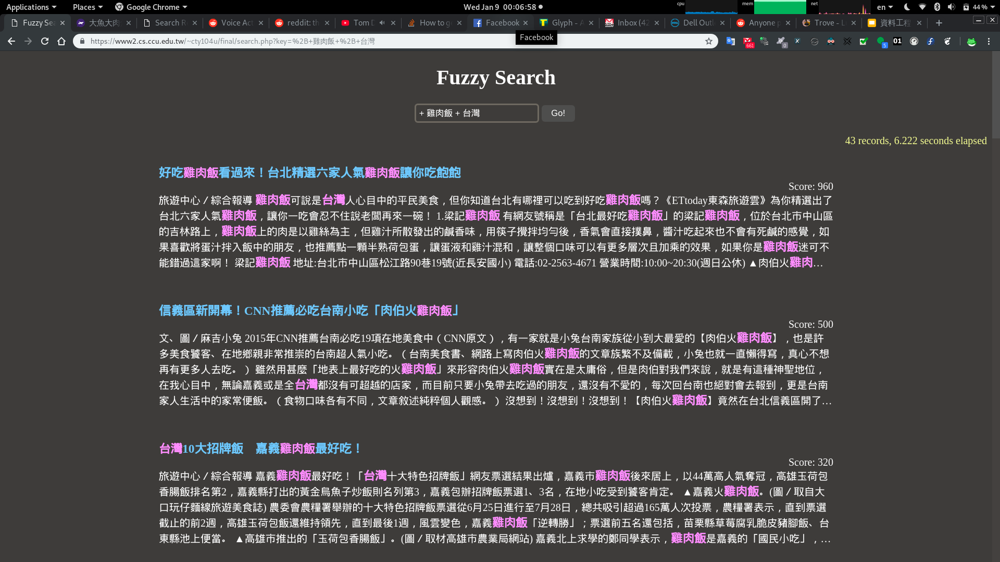

# Final Project
資工四 404410076 陳鐸元

## Web Application

-	Search rules:
	-	+ MUST_CONTAIN
	-	- MUST_NOT_CONTAIN
	-	REGULAR ( error = 0 for length < 5, error = 1 for 5 <= length < 9, else error = 2)
	-	e.g. + 雞肉飯 + 台灣
-	Keyword highlight
-	Page navigation
-	URL: [https://www2.cs.ccu.edu.tw/~cty104u/final/search.php](https://www2.cs.ccu.edu.tw/~cty104u/final/search.php)

## Structrue

1.	Record split(multi-thread)
2.	Calculate scores(multi-thread)
	1.	If error = 0, use Boyer Moore(Bad Character + Good Suffix)
	2.	Else, use Levenshtein Distance
3.	Sort
4.	Write to file
5.	Get contents for specified page
6.	Apply highlights

## Code

### Record Split

```cpp
int uidx = unparsed.find(args.url, idx) + args.url.size();
int tidx = unparsed.find(args.title, uidx);
int cidx = unparsed.find(args.content, tidx + args.title.size());
inp.url = unparsed.substr(uidx, tidx - uidx);
tidx += args.title.size();
inp.title = unparsed.substr(tidx, cidx - tidx);
cidx += args.content.size() + 1;
int endidx = unparsed.find(args.delimiter, cidx + args.content.size());
inp.content = unparsed.substr(cidx, endidx - cidx);
idx = endidx + 1;
```

### Boyer Moore

```cpp
unordered_map<char, int> occurred;
for (unsigned int i = 0; i < A.size(); i++)
{
	occurred[A[i]] = i;
}

// bmPreprocess1();
vector<int> border_front(A.size() + 1);
vector<int> shift(A.size() + 1);
size_t i = A.size(), j = A.size() + 1;
border_front[i] = j;
while (i > 0)
{
	while (j <= A.size() && A[i-1] != A[j-1])
	{
		if (shift[j] == 0)
			shift[j] = j - i;
		j = border_front[j];
	}
	border_front[--i] = --j;
}

// bmPreprocess2();
j = border_front[0];
for(i = 0; i <= A.size(); i++)
{
	if(shift[i] == 0)
		shift[i] = j;
	if(i == j)
		j = border_front[j];
}

// Boyer Moore Search
ll cnt = 0;
int Aidx = 0, Bidx;
while (Aidx <= int(B.size()) - int(A.size()))
{
	Bidx = A.size() - 1;
	while(Bidx >= 0 && A[Bidx] == B[Aidx + Bidx])
		--Bidx;
	if (Bidx < 0)
	{
		++cnt;
		Aidx += shift[0];
	}
	else
		Aidx += max((shift[Bidx + 1]), Bidx - (occurred.find(B[Aidx + Bidx]) != occurred.end() ? occurred[B[Aidx + Bidx]] : -1));
}
return cnt;
```

### Levenshtein Distance

```cpp
vector<int> table(A.size() + 1);

for(size_t i = 0; i <= A.size(); i++)
	table[i] = i;

double score = 0;

int ubound = min((int)table.size(), tolerance + 2);
for(size_t j = 0; j < B.size(); j++)
{
	for(int i = 1; i < ubound; i++)
	{
		int prev = table[i];
		table[i] = min(table[0] + (A[i - 1] != B[j]), min(table[i] + 1, table[i - 1] + 1));
		table[0] = prev;
	}
	table[0] = 0;
	while(table[--ubound] > tolerance);
	ubound = min((int)table.size(), ubound + 2);
	score += table.back() <= tolerance ? double(tolerance - table.back() + 1) / double(table.back() + 1) : 0;
}
return score;
```

### Sort

```cpp
sort(all.begin(), all.end(), [](const Record &A, const Record &B){return A.score > B.score;});
```

### Keyword highlighting

Regex Preparation
```php
$plus_stripped = preg_replace('/[+-][\s]+/', '', $trimmed);
$query_pattern = str_replace(' ', '|', $plus_stripped);
```

Substitution
```php
echo preg_replace('/(' . rtrim($query_pattern) . ')/ui', '<span class="highlight">$1</span>', $entry);
```

## Paging

The range needed to be shown on the current page is calculated in advanced. And then, it will use `sed` to get the results from `opt`/`out` in the range.

At the bottom of the page, there are 10 buttons linked to the first page, nearby pages, and the last page. You can also navigate to a page by submitting the number in the text box below.


## Code

[https://github.com/Superdanby/Search-Engine/tree/master/Project%201](https://github.com/Superdanby/Search-Engine/tree/master/Project%201)

## Screenshots


